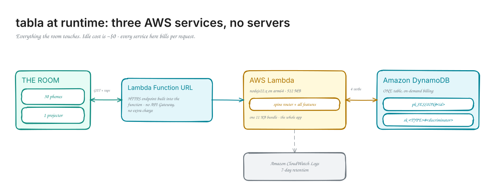
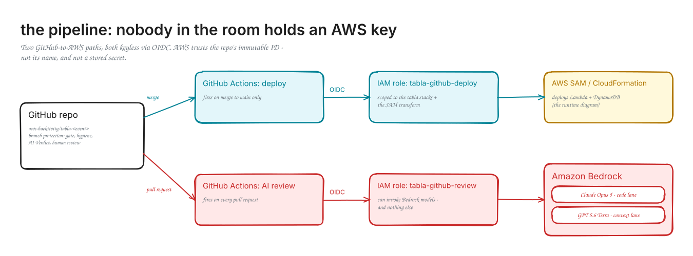

# tabla

> **TL;DR** - a live feedback board for the workshop room. Everyone's phone
> hits the same URL. Your team adds a feature by dropping ONE directory into
> `features/`, and it appears on the projector when your PR merges. No
> shared registry file, no merge conflicts. That's the whole trick.

## Quick start

```sh
npm install     # 3 dev packages, no runtime deps
npm run dev     # board on http://localhost:3000
npm run gate    # typecheck + tests - green here means green CI
```

Node 22.18+ required (TypeScript runs natively - no build step).

## How this repo works

The spine (`src/spine/`) scans `features/` at startup. Every directory with
a valid `feature.ts` gets its routes mounted under `/api/<name>` and its
card rendered on the board. A malformed feature is skipped locally (with an
error naming it) and blocks CI (the `GATE:` test).

```text
features/
  reactions/        <- worked example: copy its shape
    feature.ts      <- the code (default-exports a Feature)
    feature.test.ts <- tests, driven through the Router
    README.md       <- the spec (EARS requirements + store keys)
  _template/        <- start here for your feature
src/spine/          <- do not touch (see AGENTS.md)
```

Rules for humans and agents alike: [AGENTS.md](AGENTS.md).

## Architecture

One request path, two runtimes, one contract.



```text
   phones + projector
          |
          v
  Lambda Function URL        public by design - it is a room board
          |
     src/lambda.ts           GET /        board page (title + cards)
          |                  GET /cards   card fragments, polled every 4s
          |                  /api/*       feature routes
          v
  src/spine/router.ts        mounts every feature at /api/<feature-name>
          |                  a crashing feature 500s alone, board survives
          v
 features/<name>/feature.ts  your code: routes + an optional card
          |                  (card = HTML fragment; window.tabla.post()
          |                   makes it interactive - see reactions)
          v
   Store interface           src/spine/types.ts - the whole data contract
      /         \
 MemoryStore   DynamoDbStore
 npm run dev   deployed       one table, shared by ALL features:
 (in memory)   (single table)   pk = SESSION#<sessionId>
                                sk = <TYPE>#<discriminator>
```

The data model is the interesting decision surface. Every feature shares
one DynamoDB table and carves its own space with sort-key prefixes. The
`Store` interface gives you four verbs - `put`, `putIfAbsent`, `get`,
`query`-by-prefix - and which verb you pick IS a semantic choice:
`putIfAbsent` with a caller id in the sort key means count-once
(reactions); plain `put` on a caller-keyed sort key means latest-wins.
Your spec decides; the reviewers check that your code matches your spec.

How features get found: locally the spine scans `features/` at startup
(drop a directory in, restart, it is live). The deployed Lambda cannot
dynamic-import TypeScript, so `npm run gen` writes a static import
manifest at build time - a parity test keeps the two in lockstep, which
is why a malformed feature cannot merge.

How code ships: merge to `main` -> GitHub Actions assumes an AWS role via
OIDC (no stored credentials anywhere) -> `sam deploy` -> the board updates
in about two minutes. Nobody deploys from a laptop.



Both diagrams are editable Excalidraw scenes in `docs/diagrams/` -
regenerate with `python3 docs/diagrams/gen_tabla.py`.

## Adding your feature

1. Copy `features/_template/` to `features/<your-name>/`.
2. Write the README spec first - the spec is your team's deliverable.
3. Point your agent at the spec. It reads `AGENTS.md` on its own, and the
   PR workflow lives as a skill it loads automatically:
   `.kiro/skills/tabla-prepare-pr/`.
4. `npm run gate`, open a PR from a branch (not a fork), get a cross-team
   review, squash-merge.

## Deploying (facilitator only - attendees never need AWS)

```sh
aws login                      # creds for the burner account
./scripts/deploy.sh us-east-1  # build + sam deploy, prints the board URL
```

CI deploys on every merge to `main` once the one-time OIDC setup is done -
see `infra/github-oidc.yaml` and STATUS.md. Wipe the burner for reuse with
`./scripts/burner-cleanup.sh us-east-1`.

## Status

Stage 2 complete: DynamoDB store + Lambda (Function URL) + SAM template +
CI (gate, pr-hygiene, readiness, advisory AI review via Bedrock OIDC).
See STATUS.md for the test gates and open items.
